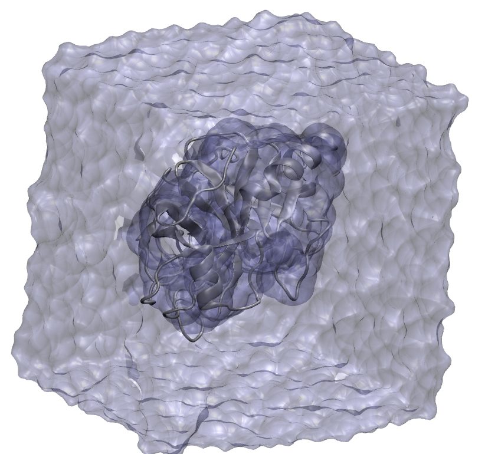
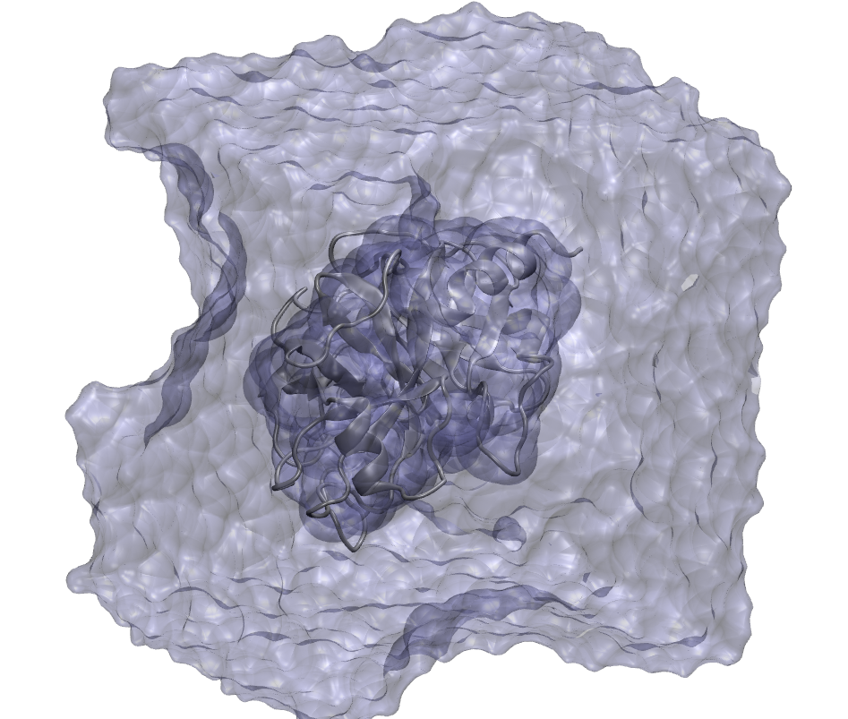
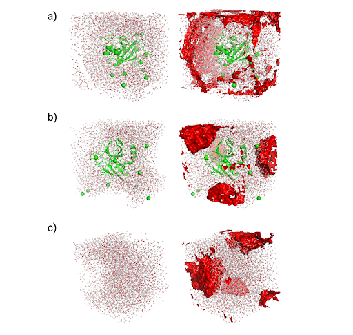
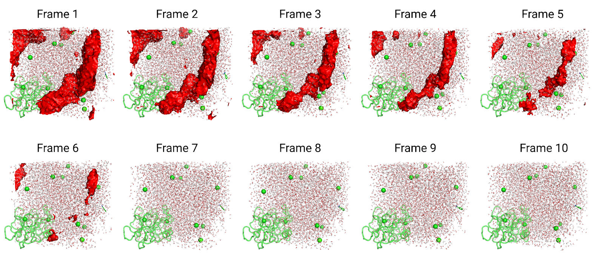
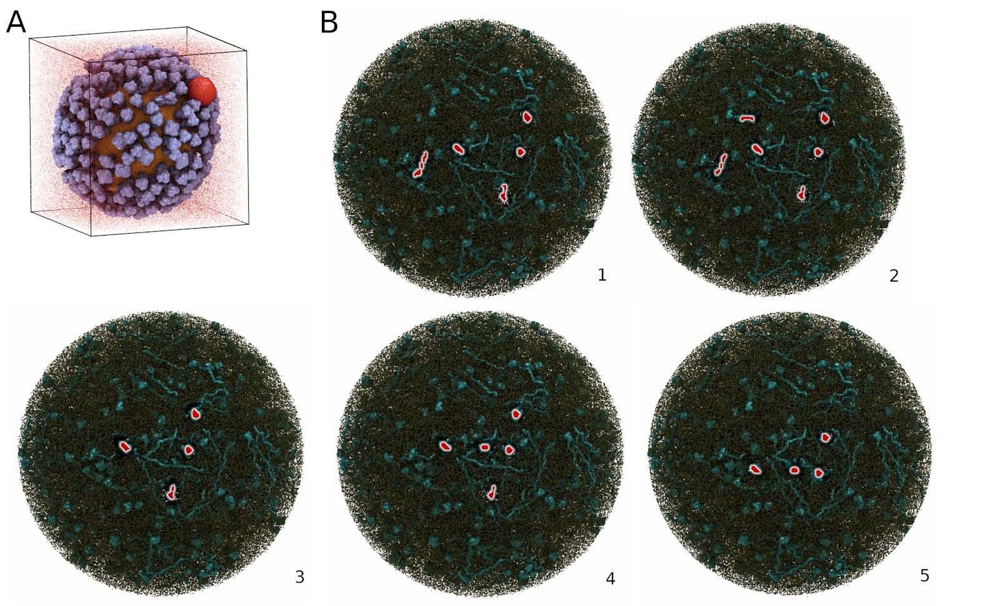
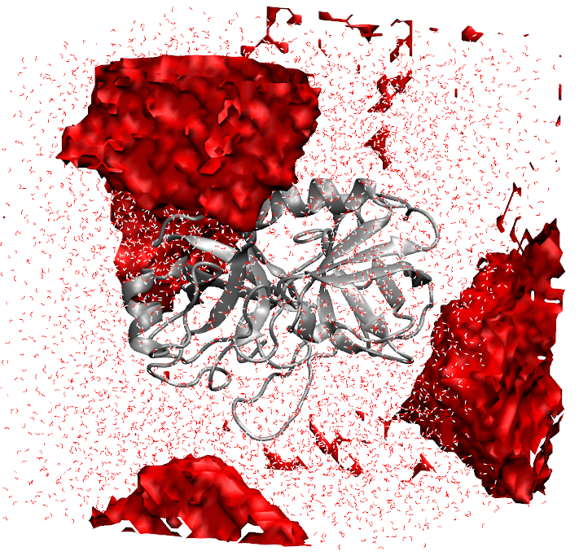

# Burbuja

<p align="center">
  <strong>Automated detection of gas bubbles, vapor pockets, and voids in molecular dynamics simulations</strong>
</p>

[](https://github.com/Abrahammc90/Burbuja/actions?query=workflow%3ACI)
[](https://codecov.io/gh/Abrahammc90/Burbuja/branch/main)
[](https://opensource.org/licenses/MIT)
[](https://www.python.org/)
[](https://doi.org/10.26434/chemrxiv-2025-rxpnd)

---

## Overview

Bubbles and vapor pockets in MD simulations are a silent hazard: they arise from incorrectly sized periodic boxes, bad starting structures, extreme energies, or faulty force-field parameters — and are easy to miss by eye. **Burbuja** (Spanish for *bubble*) automates this check, scanning any explicit-solvent structure or trajectory for voids of any shape and flagging them in seconds.

<p align="center">
  
  &nbsp;&nbsp;
  
</p>
<p align="center"><em>Left: A correctly solvated trypsin–benzamidine system — no bubble detected. Right: The same system with an improperly sized periodic box, producing a visible void.</em></p>

**Key capabilities:**
- Detects bubbles of any shape — spherical, planar, irregular, or split across periodic boundaries
- Analyzes single structures (PDB) or full MD trajectories
- Accepts any file format supported by [MDTraj](https://www.mdtraj.org) (AMBER, CHARMM, GROMACS, and more)
- Works with cubic, rectangular, and triclinic simulation boxes
- Optional GPU acceleration via [CuPy](https://cupy.dev) for large systems
- Scales to massive systems — tested on a ~1 billion-atom respiratory aerosol trajectory
- Use as a command-line tool or call the Python API from within your own scripts

For full documentation, tutorials, and API reference, see **https://burbuja.readthedocs.io/en/latest** or the `docs/` subfolder.

---

## What Can Burbuja Find?

Burbuja handles a wide range of void geometries and pathological solvation conditions:

<p align="center">
  
</p>
<p align="center"><em>Test systems with voids detected (shown in red). a) A system with incorrect truncated octahedral box vectors, producing planar-shaped voids. b) A spherical bubble split across periodic boundaries. c) A solvent-only system with a spherical bubble.</em></p>

---

## Trajectory Analysis

Burbuja can track voids across every frame of a simulation trajectory, following their evolution as they grow or dissipate:

<p align="center">
  
</p>
<p align="center"><em>Ten frames from a constant-pressure MD equilibration of the trypsin–benzamidine system. Burbuja tracked the voids (red) until their disappearance, without misclassifying the periodic image of the protein (lower-right corner).</em></p>

---

## Scales to the Largest Systems

Burbuja is designed with massive systems in mind — from typical protein–ligand complexes to entire viruses and respiratory aerosol particles:

<p align="center">
  
</p>
<p align="center"><em>A) Influenza viral capsid (~150 million atoms): an artificially generated bubble (red sphere) was correctly detected among the glycoproteins (purple) of the viral bilayer (orange). B) Respiratory aerosol equilibration trajectory (~1 billion atoms, 5 frames): bubbles (red shapes) tracked throughout the aerosol particle (proteins: cyan; phospholipids: brown).</em></p>

---

## Performance

Burbuja is fast on CPU and dramatically faster with GPU acceleration via CuPy. (— = not tested):

| System | Size (atoms) | Frames | CPU time (s) | GPU time (s) |
|---|---:|---:|---:|---:|
| Trypsin–benzamidine | ~23,000 | 1 | 1.9 | 0.6 |
| Trypsin–benzamidine | ~23,000 | 10 | 22.5 | 3.1 |
| CG Membrane System | ~31,000 | 1 | 33.0 | 2.8 |
| CG Membrane System | ~31,000 | 25,000 | — | ~57,000 |
| Influenza Virion | ~150 million | 1 | ~16,000 | ~1,200 |
| Respiratory Aerosol | ~1 billion | 1 | — | ~3,400 |
| Respiratory Aerosol | ~1 billion | 5 | — | ~13,800 |

---

## Install

The easiest way to install Burbuja is with Mamba. If you don't have Mamba, install Miniforge first:

```sh
curl -O https://github.com/conda-forge/miniforge/releases/latest/download/Miniforge3-$(uname)-$(uname -m).sh
bash Miniforge3-$(uname)-$(uname -m).sh
```

Create and activate a new environment:

```sh
mamba create -n BURBUJA python=3.11 --yes
mamba activate BURBUJA
```

**Optional — GPU acceleration:** install [CuPy](https://docs.cupy.dev/en/stable/install.html) to enable the `-c` flag:

```sh
mamba install cupy
```

Install Burbuja (all remaining dependencies are handled automatically):

```sh
pip install burbuja
```

### Install from Source

```sh
git clone https://github.com/Abrahammc90/Burbuja.git
cd Burbuja
pip install .
```

---

## Quick Start

Example files are included in `Burbuja/tests/data/` within the repository. After cloning, try running Burbuja on the provided trypsin–benzamidine structures:

```sh
# Structure with no bubble — Burbuja should report none found
burbuja Burbuja/tests/data/tb_traj.pdb

# Structure with a bubble — Burbuja will detect and report it
burbuja Burbuja/tests/data/tb_wrapped_bubble.pdb
```

To also get the bubble's volume, shape, and a DX density file for visualization in VMD or NGLView, add the `-d` flag:

```sh
burbuja Burbuja/tests/data/tb_wrapped_bubble.pdb -d
```

<p align="center">
  
</p>
<p align="center"><em>DX output from Burbuja loaded in VMD: the bubble is shown as a red isosurface, pinpointing its exact location and shape within the simulation box.</em></p>

Burbuja can also analyze trajectories directly. The following command processes all frames of a DCD trajectory and reports per-frame bubble volumes:

```sh
burbuja Burbuja/tests/data/tb_traj.dcd -t Burbuja/tests/data/tryp_ben.prmtop -d
```

If you have CuPy installed, add `-c` to enable GPU acceleration:

```sh
burbuja Burbuja/tests/data/tb_traj.dcd -t Burbuja/tests/data/tryp_ben.prmtop -d -c
```

Run `burbuja -h` for a full list of options, or visit **https://burbuja.readthedocs.io/en/latest** for detailed tutorials and API documentation.

---

## Authors and Contributors

The following people have contributed directly to the coding and validation of Burbuja (listed alphabetically by last name).
Thanks also to everyone who has helped improve this project through feedback, bug reports, or other contributions.

- Rommie Amaro (principal investigator)
- Abraham Muñiz Chicharro (developer)
- Lane Votapka (developer)

---

## Citing Burbuja

If you use Burbuja in your work, please cite:

> Muñiz-Chicharro A, Votapka LW, Amaro RE. Detection of gas bubbles and local voids in molecular simulations using burbuja. Protein Science. 2026;35(5): e70562. https://doi.org/10.1002/pro.70562

---

### Copyright

Copyright (c) 2026, Abraham Muñiz Chicharro and Lane Votapka
